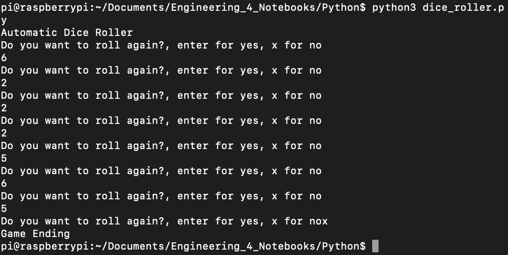
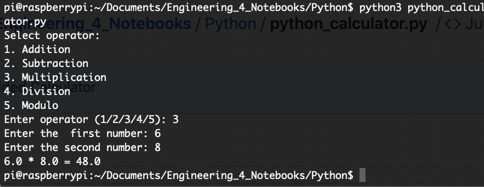
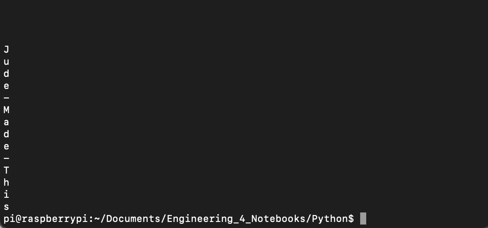
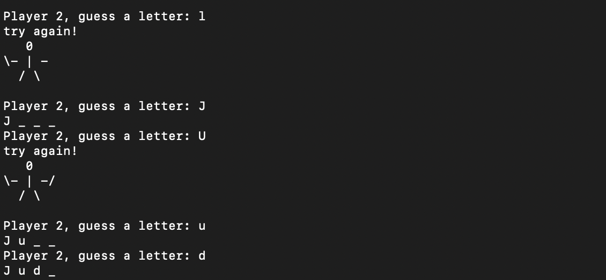

# Engineering_4_Notebooks

## Hello World

### Description & Lesson Learned
Creating this and logging into the pi was not very hard except my pi wouldn't connect to my mac for some reason. it took me 2 days to do it but eventually with some help from Dr. Shields I got it. I was having lots of trouble but I used to have a raspberry pi so some of the syntax isn't that hard for me to understand.

## Get Your Pi Online

### Description & Lesson Learned
This one was harder than the last one, not because I couldn't get it online, but because I messed up and accidentally cloned my github repo inside of my github repo. This provided problems for me, but once Dr. Shields helped me with the delete message, it was smooth sailing from there. I think this shows how one small thing can mess you up, and you have to work backwards from there. In code this happens a lot and this was my first such instance this year.

## Hello Python

### Description & Lesson Learned
This one wasn't very hard, I just had to remember how to commit the dice_roller.py to my GitHub which means I had to watch the pi online video again. The while loop wasn't very challenging, the only thing is I am not that used to booleans but they don't seem to hard to use. For the future, I need to remember how to commit things to my GitHub, and one annoying thing is if you have a syntax error, it only tells you 1 line at a time, so you have to continually go back.

### Picture

## Calculator

### Description 
Make a calculator function that can calculate addition, subtraction, multiplication, division, and modulo for two numbers

### Lesson Learned
I had trouble understanding the functions in Python as I didn't really understand the 'return' line that Dr. Shields used. But once I looked it up I began to understand that it ends the function and returns that operation from the value. I had to look up a few things, but with Harry's help, we figured out how to do it.

### Picture

## Quadratic Formula

### Description
Make a calculator that will, when input 3 numbers, find if those numbers have roots in the standard **ax^2 + bx + c** form.

### Lesson Learned
This project helped me expand my knowledge of functions more ad I struggled hard with the last one, but this one seemed to just click. I looked up a few things such as how to find the discrinimant and implement it in python. (the discrinimant is the part under the square root: **b^2 - 4*a*c**) Functions becoming easier for me is beneficial because I dont have to have 150 lines of code now, i can just call a function I made and everything looks more compact.

## Strings and Loops

### Description
Using the _split()_ function, make an application to print out a sentence, letter by letter, and replace spaces with "-"

### Lesson Learned
At the start, I had trouble understanding the split() function. I would split the sentence once, which would simply give me the words, and then I would add those to an array and attempt to split them again. Only when we started using **repl.it**, and I started working collaboratively with Harry is when I realized it was much simpler than that. You can just split it twice!

### Picture

## MSP

### Description
Using your knowledge, create a two player hangman game that displays the hangman when someone gets one wrong.

### Lesson Learned
I had a good bit of trouble wwith this to begin with, but after a day or so, the hangman part seemed to make snese, and replacing every letter from the word with an underscore wasnt a challenge because I did a similar thing in strings and loops. The hardest part was determining how to do the hangman. I tried to do a function and array multiple times, but It never seemed to work so I switched to if statements under a boolean.

### Picture

## SSH

### Description

You have to use SSH to activate an LED remotely.

### Lesson Learned

I was skeptical of how hard this assignment would be but since Dr. Shields said to do it first, I assumed it wouldn't be that bad. It was relatively hard getting used to GPIO but i got it in the end and it seems that the SSH is really useful and I will have to use it in later assignments.

### Picture

## Bash

### Description

Make 2 LEDs blink 10 times using bash

### Lesson Learned

This one wasn't that bad and I figured out where to go and what to do thanks to other student's GitHub pages. I found a little bit of trouble with some parts but through some research I figured out what my goal was. In the future, I need to research more online because I was stuck for a little bit but with just a few searches I was able to find what I needed.

Code: https://github.com/jfairch81/Engineering_4_Notebooks/blob/main/Python/led_bash.py

### Picture

## Python

### Description

This is the same premise as SSH but without SSH.

### Lesson Learned

Since I had already done SSH this one was pretty straightforward. I had almost no trouble with it and I kept the same wiring as previous assignments. I'm now glad I did SSH first.

### Picture 

## Hello Flask

### Description

Set up the Pi to be on a web server just by typing in its IP address

### Lesson Learned

This program was hard to think about when I was first starting, but I have learned to map out and write down what I need before I start coding, so once I did that, I had little trouble. I didn't know that the pi was supposed to go blank when it was running, but I eventually figured it out. I then went to another computer in my house to see if it worked and it did.

## GPIO Flask

### Description 

Turn on and off 2 leds wireless from another computer

### Lesson Learned

Personally, I found this assignment troubling because I had to research about HTML, but I think this assignment has helped me get new ideas for how I can run my project this year. Including a second computer in the mix, and having it control parts of the Pi makes everything so much cooler. I might try to implement something similar into my actual project. I also had to look at other students wiring diagrams which saved me a good bit of time. Also, I once again forgot the correct process to push to GitHub so I went back to the Strings_and_Loops assignment and found the right way there!

## GPIO Pins - I2C

### Description

Set up and use the accelerometer with a display to show x, y, and z acceleration

### Lesson Learned

This assignment caused me a bit of struggle because I almost completed it a while ago, stopped to work on my project, and then I couldn't get into my Pi because I got new wifi. The good thing is, I ordered a new serial cable from Adafruit thanks to some help from Dr. Shields. The directions to the project were pretty easy wiring and the hardest part was probably the code, but since I got some help from Harry and my other classmates, it wasn't too bad. I liked how the directions outlined everything I needed to do and made them straightforward. I'm glad I got this done because we almost finished the code for the accelerometer, and I want to test it out. The link to the USB Serial Cable is : https://www.adafruit.com/product/954?gclid=Cj0KCQjwnueFBhChARIsAPu3YkTZqVgpFf9V17jmUWxFpPt1tC-zAcmSlp8U8G1gzp_OFXE2_Jy1HmIaAt5WEALw_wcB
